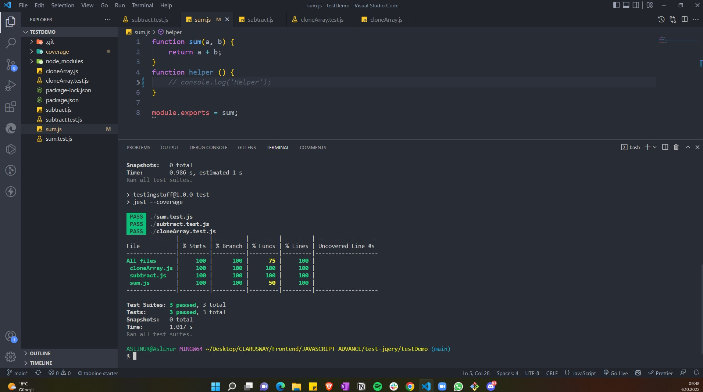

# Project : Test Demo

## Visulation of the Website

## Description

Project aims get information about jest testing via a javascript.

## Learning Outcomes

At the end of the this project, you will be able to;

- analyze a problem,

- demonstrate your knowledge of algorithmic design principles,

- get information about jest testing via a javascript.

## Project Skeleton 

|----testDemo

        |----cloneArray.js  
        |----cloneArray.test.js
        |----style.css
        |----demo.jpg
        |----package-lock.json
        |----package.json
        |----subtract.js
        |----subtract.test.js
        |----sum.js
        |----sum.test.js

### Overview
I mastered HTML, CSS and Javascript jest testing features in this project. You can see the visual representation of the website above.

:fire: You can use [GITHUB API](https://api.github.com/users/) for your app. 
